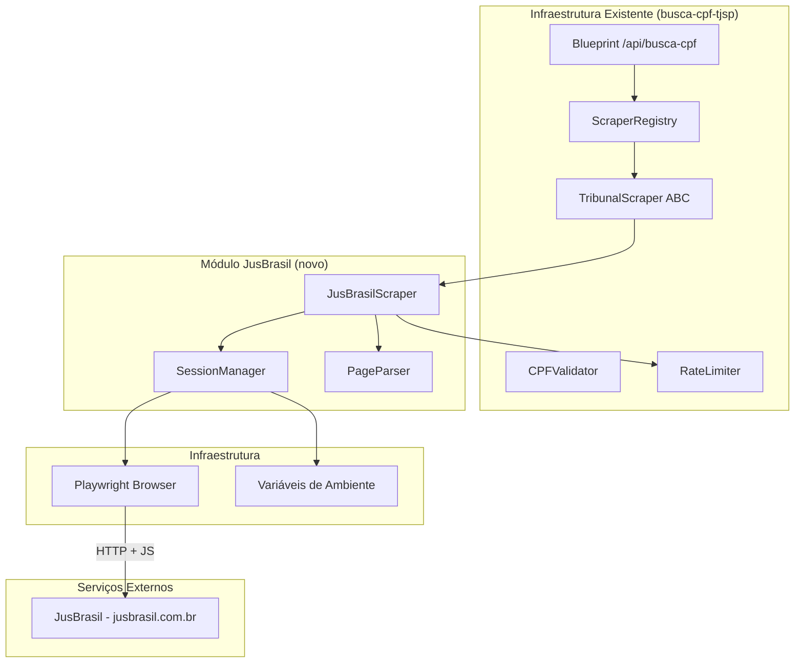
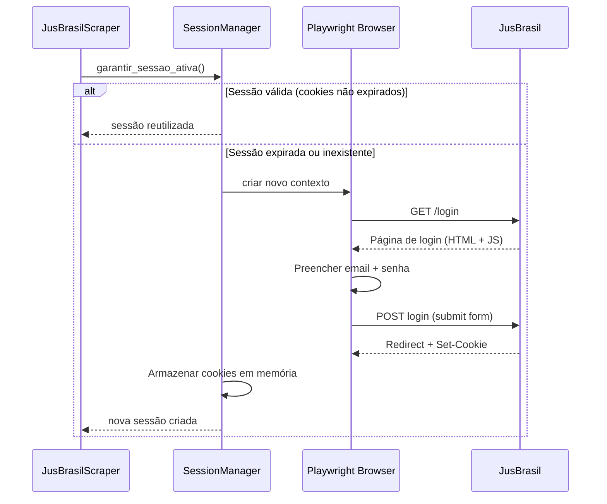
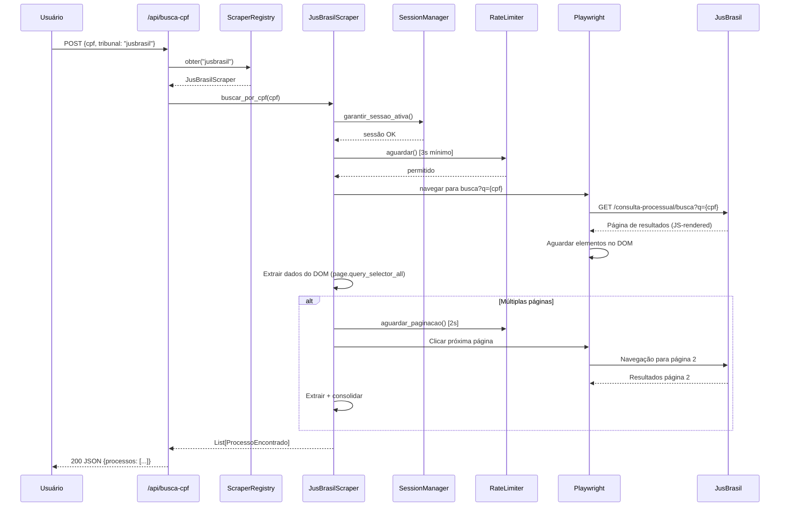

# Documento de Design — Busca de Processos por CPF (JusBrasil)

## Visão Geral

Este documento descreve o design técnico do scraper JusBrasil para busca de processos judiciais por CPF. Diferentemente do scraper ESAJ/TJSP (que usa `requests` + BeautifulSoup para páginas server-rendered), o JusBrasil exige:

1. **Autenticação** — login com email/senha antes de acessar dados
2. **Headless browser** — páginas JavaScript-heavy que não funcionam com requests simples
3. **Gerenciamento de sessão** — cookies persistentes para evitar login a cada busca

O JusBrasil agrega processos de **todos os tribunais brasileiros**, sendo a principal vantagem sobre o ESAJ (limitado ao TJSP).

### Decisões de Design

| Decisão | Escolha | Justificativa |
|---------|---------|---------------|
| Headless Browser | Playwright (async) | Suporte nativo a stealth, melhor API que Selenium |
| Sessão | Playwright BrowserContext com cookies | Persistência de sessão sem re-login |
| Rate Limiting | Intervalo 3s (mesmo padrão do TJSP, mais conservador) | JusBrasil tem detecção anti-bot mais agressiva |
| Anti-bot | User-agent real + delays aleatórios + stealth mode | Reduzir detecção de automação |
| Interface | Implementa TribunalScraper ABC (da spec busca-cpf-tjsp) | Consistência arquitetural |
| Credenciais | Variáveis de ambiente (.env) | Segurança — nunca em código |

### Integração com Arquitetura Existente

O scraper JusBrasil **reutiliza** toda a infraestrutura definida na spec `busca-cpf-tjsp`:

- `TribunalScraper` ABC — interface que o JusBrasilScraper implementa
- `ProcessoEncontrado` dataclass — formato de retorno padronizado
- `ScraperRegistry` — registro automático do scraper
- `CPFValidator` — validação de CPF (compartilhado)
- Blueprint `/api/busca-cpf` — endpoint existente (já suporta múltiplos tribunais)
- Frontend `BuscaCPF` — componente existente (já tem dropdown de tribunal)

O JusBrasil é adicionado como **mais um scraper registrado**, sem alterações na API ou frontend (além de aparecer no dropdown).

---

## Arquitetura

### Diagrama de Componentes (JusBrasil-específico)



### Fluxo de Autenticação



### Fluxo de Busca por CPF



---

## Componentes e Interfaces

### JusBrasilScraper (implementa TribunalScraper)

```python
from app.services.busca_cpf.base import TribunalScraper, ProcessoEncontrado
from app.services.busca_cpf.rate_limiter import RateLimiter
from typing import List


class JusBrasilScraper(TribunalScraper):
    """Scraper para busca de processos por CPF no JusBrasil.
    
    Utiliza Playwright para renderizar páginas JavaScript-heavy
    e SessionManager para autenticação persistente.
    
    URL de busca: https://www.jusbrasil.com.br/consulta-processual/busca?q={cpf}
    """

    BUSCA_URL = "https://www.jusbrasil.com.br/consulta-processual/busca?q={cpf}"
    LOGIN_URL = "https://www.jusbrasil.com.br/login"
    TIMEOUT = 30_000  # ms (Playwright usa milissegundos)

    def __init__(self, session_manager: 'SessionManager', rate_limiter: RateLimiter):
        self._session_manager = session_manager
        self._rate_limiter = rate_limiter

    @property
    def tribunal_id(self) -> str:
        return "jusbrasil"

    @property
    def tribunal_nome(self) -> str:
        return "JusBrasil - Todos os Tribunais"

    def buscar_por_cpf(self, cpf: str) -> List[ProcessoEncontrado]:
        """Busca processos por CPF no JusBrasil.
        
        Fluxo:
        1. Garante sessão autenticada (login se necessário)
        2. Navega para URL de busca com CPF
        3. Aguarda renderização dos resultados (JS)
        4. Extrai dados de cada processo listado
        5. Se há paginação, navega por todas as páginas
        6. Retorna lista consolidada
        
        Raises:
            TribunalIndisponivelError: JusBrasil offline ou timeout.
            CaptchaDetectadoError: CAPTCHA detectado.
            ScrapingError: Estrutura HTML inesperada.
            AutenticacaoError: Falha no login.
        """
        ...

    def health_check(self) -> dict:
        """Verifica se sessão está ativa e JusBrasil acessível.
        
        Returns:
            {"status": "ok"|"error", "sessao_ativa": bool, "detalhes": str}
        """
        ...

    def _construir_url_busca(self, cpf: str) -> str:
        """Constrói URL de busca com CPF (apenas dígitos)."""
        return self.BUSCA_URL.format(cpf=cpf)

    def _extrair_processos_pagina(self, page) -> List[ProcessoEncontrado]:
        """Extrai processos da página atual usando seletores DOM."""
        ...

    def _tem_proxima_pagina(self, page) -> bool:
        """Verifica se existe botão de próxima página."""
        ...

    def _navegar_proxima_pagina(self, page) -> None:
        """Clica no botão de próxima página e aguarda carregamento."""
        ...

    def _detectar_captcha(self, page) -> bool:
        """Verifica se a página atual contém CAPTCHA."""
        ...

    def _detectar_bloqueio(self, page) -> bool:
        """Verifica se houve bloqueio por detecção de automação."""
        ...
```

### SessionManager

```python
import os
import time
from typing import Optional
from playwright.sync_api import sync_playwright, Browser, BrowserContext, Page


class SessionManager:
    """Gerenciador de sessão autenticada no JusBrasil.
    
    Responsabilidades:
    - Realizar login com credenciais do .env
    - Manter cookies de sessão em memória
    - Detectar expiração e re-autenticar
    - Garantir no máximo uma sessão ativa
    
    Credenciais:
    - JUSBRASIL_EMAIL: email de login
    - JUSBRASIL_PASSWORD: senha de login
    """

    LOGIN_URL = "https://www.jusbrasil.com.br/login"
    SESSION_CHECK_URL = "https://www.jusbrasil.com.br/consulta-processual"
    MAX_LOGIN_ATTEMPTS = 2
    USER_AGENT = (
        "Mozilla/5.0 (Windows NT 10.0; Win64; x64) "
        "AppleWebKit/537.36 (KHTML, like Gecko) "
        "Chrome/120.0.0.0 Safari/537.36"
    )

    def __init__(self):
        self._browser: Optional[Browser] = None
        self._context: Optional[BrowserContext] = None
        self._ultimo_login: float = 0.0
        self._sessao_ativa: bool = False
        self._email: Optional[str] = None
        self._password: Optional[str] = None

    def _carregar_credenciais(self) -> tuple[str, str]:
        """Carrega credenciais das variáveis de ambiente.
        
        Returns:
            Tupla (email, password).
            
        Raises:
            CredenciaisNaoConfiguradasError: Se variáveis não existem.
        """
        email = os.environ.get('JUSBRASIL_EMAIL')
        password = os.environ.get('JUSBRASIL_PASSWORD')
        if not email or not password:
            raise CredenciaisNaoConfiguradasError()
        return email, password

    def garantir_sessao_ativa(self) -> BrowserContext:
        """Garante que existe uma sessão autenticada válida.
        
        Se não há sessão ou ela expirou, realiza novo login.
        Reutiliza sessão existente se cookies ainda são válidos.
        
        Returns:
            BrowserContext autenticado pronto para navegação.
            
        Raises:
            AutenticacaoError: Se login falha após MAX_LOGIN_ATTEMPTS.
            CredenciaisNaoConfiguradasError: Se credenciais ausentes.
        """
        ...

    def _realizar_login(self) -> BrowserContext:
        """Executa fluxo de login no JusBrasil.
        
        Fluxo:
        1. Navega para página de login
        2. Preenche campo de email
        3. Preenche campo de senha
        4. Submete formulário
        5. Aguarda redirect (indica sucesso)
        6. Armazena cookies do contexto
        
        Returns:
            BrowserContext com sessão autenticada.
            
        Raises:
            AutenticacaoError: Se login falha.
        """
        ...

    def _verificar_sessao_valida(self) -> bool:
        """Verifica se a sessão atual ainda é válida.
        
        Faz requisição leve ao JusBrasil e verifica se não
        há redirect para login (indica sessão expirada).
        
        Returns:
            True se sessão válida, False se expirada.
        """
        ...

    def _descartar_sessao(self) -> None:
        """Descarta sessão atual, fechando contexto do browser."""
        ...

    def _inicializar_browser(self) -> Browser:
        """Inicializa Playwright browser em modo headless com stealth."""
        ...

    @property
    def sessao_ativa(self) -> bool:
        """Indica se há sessão ativa no momento."""
        return self._sessao_ativa

    def fechar(self) -> None:
        """Fecha browser e libera recursos."""
        ...
```

### PageParser (extração de dados do DOM)

```python
from typing import List, Optional
from playwright.sync_api import Page
from app.services.busca_cpf.base import ProcessoEncontrado


class JusBrasilPageParser:
    """Parser para extração de dados de processos das páginas do JusBrasil.
    
    Seletores CSS esperados (baseados na estrutura atual do JusBrasil):
    - Container de resultados: div com lista de processos
    - Número CNJ: elemento com número formatado
    - Tribunal: badge ou texto indicando tribunal de origem
    - Classe: tipo do processo
    - Partes: nomes das partes envolvidas
    """

    # Seletores CSS (podem mudar se JusBrasil alterar layout)
    SELETOR_RESULTADO = '[data-testid="process-list-item"]'
    SELETOR_NUMERO = '[data-testid="process-number"]'
    SELETOR_TRIBUNAL = '[data-testid="process-court"]'
    SELETOR_CLASSE = '[data-testid="process-class"]'
    SELETOR_PARTES = '[data-testid="process-parties"]'
    SELETOR_PAGINACAO_PROXIMA = '[data-testid="pagination-next"]'
    SELETOR_CAPTCHA = 'iframe[src*="captcha"], div.captcha-container'
    SELETOR_BLOQUEIO = '[data-testid="blocked-message"]'

    # Fallback selectors (caso data-testid não exista)
    SELETOR_RESULTADO_FALLBACK = '.ProcessList-item, .search-result-item'
    SELETOR_NUMERO_FALLBACK = '.process-number, .lawsuit-number'

    @staticmethod
    def extrair_processos(page: Page) -> List[ProcessoEncontrado]:
        """Extrai todos os processos visíveis na página atual.
        
        Tenta seletores primários (data-testid), depois fallback.
        
        Args:
            page: Página Playwright com resultados carregados.
            
        Returns:
            Lista de ProcessoEncontrado extraídos.
            
        Raises:
            ScrapingError: Se estrutura HTML não corresponde ao esperado.
        """
        ...

    @staticmethod
    def detectar_captcha(page: Page) -> bool:
        """Verifica presença de CAPTCHA na página."""
        ...

    @staticmethod
    def detectar_bloqueio(page: Page) -> bool:
        """Verifica se página indica bloqueio por automação."""
        ...

    @staticmethod
    def tem_proxima_pagina(page: Page) -> bool:
        """Verifica se existe botão de próxima página habilitado."""
        ...

    @staticmethod
    def _extrair_numero_cnj(elemento) -> Optional[str]:
        """Extrai e valida número CNJ de um elemento de resultado."""
        ...

    @staticmethod
    def _extrair_tribunal(elemento) -> Optional[str]:
        """Extrai nome/sigla do tribunal de origem."""
        ...

    @staticmethod
    def _extrair_partes(elemento) -> List[str]:
        """Extrai nomes das partes do processo."""
        ...
```

### Exceções Específicas do JusBrasil

```python
class AutenticacaoError(Exception):
    """Falha na autenticação com o JusBrasil."""
    def __init__(self, motivo: str):
        self.motivo = motivo
        super().__init__(f"Falha na autenticação JusBrasil: {motivo}")


class CredenciaisNaoConfiguradasError(Exception):
    """Credenciais do JusBrasil não encontradas nas variáveis de ambiente."""
    def __init__(self):
        super().__init__(
            "Credenciais do JusBrasil não configuradas. "
            "Defina JUSBRASIL_EMAIL e JUSBRASIL_PASSWORD no .env"
        )


class SessaoExpiradaError(Exception):
    """Sessão do JusBrasil expirou durante operação."""
    def __init__(self):
        super().__init__("Sessão do JusBrasil expirou")
```

### Registro no ScraperRegistry

```python
# Em app/services/busca_cpf/__init__.py (atualização)

from app.services.busca_cpf.registry import ScraperRegistry
from app.services.busca_cpf.rate_limiter import RateLimiter
from app.services.busca_cpf.jusbrasil.scraper import JusBrasilScraper
from app.services.busca_cpf.jusbrasil.session_manager import SessionManager

def criar_registry() -> ScraperRegistry:
    """Cria e configura o registry com todos os scrapers disponíveis."""
    registry = ScraperRegistry()
    
    # TJSP (existente)
    from app.services.busca_cpf.esaj_scraper import ESAJScraperTJSP
    rate_limiter_tjsp = RateLimiter(intervalo_minimo=2.0)
    registry.registrar(ESAJScraperTJSP(rate_limiter_tjsp))
    
    # JusBrasil (novo)
    try:
        session_manager = SessionManager()
        rate_limiter_jb = RateLimiter(intervalo_minimo=3.0)
        registry.registrar(JusBrasilScraper(session_manager, rate_limiter_jb))
    except CredenciaisNaoConfiguradasError:
        # JusBrasil não disponível sem credenciais — não registra
        pass
    
    return registry
```

### Estrutura de Diretórios (novo módulo)

```
backend/app/services/busca_cpf/
├── __init__.py              # criar_registry()
├── base.py                  # TribunalScraper ABC, ProcessoEncontrado
├── registry.py              # ScraperRegistry
├── rate_limiter.py          # RateLimiter
├── cpf_validator.py         # CPFValidator
├── exceptions.py            # Exceções compartilhadas
├── esaj_scraper.py          # ESAJScraperTJSP (existente)
└── jusbrasil/               # ← NOVO
    ├── __init__.py
    ├── scraper.py           # JusBrasilScraper
    ├── session_manager.py   # SessionManager
    ├── page_parser.py       # JusBrasilPageParser
    └── exceptions.py        # AutenticacaoError, CredenciaisNaoConfiguradasError
```

---

## Modelos de Dados

### ProcessoEncontrado (reutilizado)

O JusBrasil retorna os mesmos campos que o ESAJ, usando o mesmo dataclass:

```python
@dataclass
class ProcessoEncontrado:
    """Processo retornado pela busca por CPF (compartilhado entre scrapers)."""
    numero_cnj: str           # Ex: "1234567-89.2023.8.26.0100"
    classe: str               # Ex: "Procedimento Comum Cível"
    assunto: str              # Ex: "Indenização por Dano Moral"
    partes: List[str]         # Ex: ["João Silva", "Maria Santos"]
    vara: Optional[str]       # Ex: "1ª Vara Cível" (pode ser None no JusBrasil)
    data_distribuicao: Optional[str]  # Ex: "15/03/2023"
```

**Diferenças JusBrasil vs ESAJ:**
- JusBrasil inclui o **tribunal de origem** nos resultados (TJSP, TJRJ, TRT, etc.)
- O campo `vara` pode não estar disponível em todos os resultados do JusBrasil
- O campo `assunto` pode vir como categoria genérica no JusBrasil

### Resposta da API (mesmo formato)

```json
{
  "processos": [
    {
      "numero_cnj": "1234567-89.2023.8.26.0100",
      "classe": "Procedimento Comum Cível",
      "assunto": "Direito Civil",
      "partes": ["João Silva", "Empresa XYZ Ltda"],
      "vara": null,
      "data_distribuicao": "2023-03-15"
    }
  ],
  "total": 12,
  "tribunal": "jusbrasil",
  "tribunal_nome": "JusBrasil - Todos os Tribunais"
}
```

### Estrutura HTML Esperada do JusBrasil (Resultados)

O JusBrasil renderiza resultados via JavaScript. A estrutura DOM após renderização:

```html
<!-- Página de resultados: /consulta-processual/busca?q={cpf} -->
<div class="search-results">
  <!-- Cada processo -->
  <div data-testid="process-list-item" class="ProcessList-item">
    <span data-testid="process-number" class="process-number">
      1234567-89.2023.8.26.0100
    </span>
    <span data-testid="process-court" class="process-court">
      TJSP
    </span>
    <span data-testid="process-class" class="process-class">
      Procedimento Comum Cível
    </span>
    <div data-testid="process-parties" class="process-parties">
      <span>João Silva</span>
      <span>Empresa XYZ Ltda</span>
    </div>
  </div>
  <!-- Mais processos... -->
</div>

<!-- Paginação -->
<nav class="pagination">
  <button data-testid="pagination-next" class="next-page">
    Próxima
  </button>
</nav>
```

**Nota:** Os seletores CSS podem mudar sem aviso. O parser implementa fallback selectors e lança `ScrapingError` com detalhes quando a estrutura não é reconhecida.

### Página de Login do JusBrasil

```html
<!-- https://www.jusbrasil.com.br/login -->
<form class="login-form">
  <input type="email" name="email" placeholder="E-mail" />
  <input type="password" name="password" placeholder="Senha" />
  <button type="submit">Entrar</button>
</form>
```

Seletores para login:
- Email: `input[name="email"], input[type="email"]`
- Senha: `input[name="password"], input[type="password"]`
- Submit: `button[type="submit"], form button`

---

## Propriedades de Corretude

*Uma propriedade é uma característica ou comportamento que deve ser verdadeiro em todas as execuções válidas de um sistema — essencialmente, uma declaração formal sobre o que o sistema deve fazer. Propriedades servem como ponte entre especificações legíveis por humanos e garantias de corretude verificáveis por máquina.*

### Propriedade 1: Reutilização de sessão válida

*Para qualquer* sequência de N buscas (N ≥ 2) realizadas enquanto a sessão está válida (cookies não expirados), o SessionManager SHALL executar login exatamente uma vez (na primeira busca) e reutilizar a mesma sessão nas N-1 buscas subsequentes.

**Valida: Requisitos 1.3, 4.1, 4.2**

### Propriedade 2: Renovação de sessão expirada

*Para qualquer* busca em andamento onde a sessão expira (resposta 401/403 ou cookie inválido), o SessionManager SHALL descartar a sessão atual, realizar novo login e repetir a requisição que falhou, retornando resultado válido ao final.

**Valida: Requisitos 1.4, 4.3**

### Propriedade 3: Invariante de sessão única

*Para qualquer* sequência de operações de login/logout/expiração, o SessionManager SHALL manter no máximo uma sessão ativa por vez. Após criar uma nova sessão, a sessão anterior (se existia) SHALL estar descartada.

**Valida: Requisitos 4.4**

### Propriedade 4: Construção correta de URL de busca

*Para qualquer* CPF válido (11 dígitos numéricos com check digits corretos), o scraper SHALL construir a URL `https://www.jusbrasil.com.br/consulta-processual/busca?q={cpf}` onde `{cpf}` contém apenas os 11 dígitos sem formatação.

**Valida: Requisitos 2.1**

### Propriedade 5: Extração completa de dados do DOM

*Para qualquer* página do JusBrasil contendo N processos (N ≥ 1) com estrutura HTML válida, o parser SHALL extrair exatamente N objetos `ProcessoEncontrado`, cada um contendo: `numero_cnj` não-vazio em formato CNJ válido, `classe` não-vazia, e `partes` como lista não-vazia de strings.

**Valida: Requisitos 2.2, 2.4, 10.1**

### Propriedade 6: Consolidação de paginação

*Para qualquer* resultado de busca com P páginas (P ≥ 1), onde cada página contém entre 1 e M processos, o scraper SHALL retornar a união de todos os processos de todas as páginas, sem duplicatas e sem omissões, totalizando a soma dos processos de cada página.

**Valida: Requisitos 2.3**

### Propriedade 7: HTML inesperado gera ScrapingError

*Para qualquer* página HTML que não contenha os seletores esperados (nem primários nem fallback) para resultados de processos, o parser SHALL lançar `ScrapingError` com detalhes sobre quais elementos estão ausentes, sem lançar exceções genéricas não tratadas.

**Valida: Requisitos 5.3**

### Propriedade 8: Rate limiter garante intervalo mínimo de 3 segundos

*Para qualquer* sequência de N requisições (N ≥ 2) submetidas ao rate limiter do JusBrasil, o intervalo de tempo entre a i-ésima e a (i+1)-ésima requisição efetivamente executada SHALL ser ≥ 3 segundos.

**Valida: Requisitos 6.1, 6.2**

### Propriedade 9: Rate limiter garante intervalo de paginação de 2 segundos

*Para qualquer* sequência de requisições de paginação consecutivas no JusBrasil, o intervalo entre cada par de requisições SHALL ser ≥ 2 segundos.

**Valida: Requisitos 6.4**

### Propriedade 10: Senha nunca aparece em logs

*Para qualquer* operação de login (sucesso ou falha) com qualquer senha fornecida, nenhum registro de log gerado pelo sistema SHALL conter a senha em texto claro. O email pode ser logado para diagnóstico, mas a senha NUNCA.

**Valida: Requisitos 9.4**

---

## Tratamento de Erros

### Erros de Autenticação

| Cenário | Exceção | Resposta HTTP | Mensagem ao Usuário |
|---------|---------|---------------|---------------------|
| Credenciais não configuradas | `CredenciaisNaoConfiguradasError` | 503 | "Busca via JusBrasil não disponível. Credenciais não configuradas." |
| Login falhou (senha incorreta) | `AutenticacaoError` | 502 | "Não foi possível autenticar no JusBrasil. Verifique as credenciais configuradas." |
| Login falhou (JusBrasil offline) | `TribunalIndisponivelError` | 502 | "O JusBrasil está temporariamente indisponível." |
| Sessão expirou + re-login falhou | `AutenticacaoError` | 502 | "Sessão expirada e não foi possível reconectar ao JusBrasil." |

### Erros de Navegação/Scraping

| Cenário | Exceção | Resposta HTTP | Mensagem ao Usuário |
|---------|---------|---------------|---------------------|
| Timeout (>30s) | `TribunalIndisponivelError` | 502 | "O JusBrasil está demorando para responder. Tente novamente em alguns minutos." |
| CAPTCHA detectado | `CaptchaDetectadoError` | 503 | "O JusBrasil está exigindo verificação humana. Aguarde alguns minutos." |
| Bloqueio anti-bot (429) | `TribunalIndisponivelError` | 503 | "Acesso temporariamente bloqueado pelo JusBrasil. Aguarde antes de tentar novamente." |
| HTML inesperado | `ScrapingError` | 502 | "Ocorreu um erro ao ler os dados do JusBrasil. A equipe técnica foi notificada." |
| Erro de conexão | `TribunalIndisponivelError` | 502 | "Não foi possível conectar ao JusBrasil." |
| HTTP 5xx | `TribunalIndisponivelError` | 502 | "O JusBrasil está com problemas técnicos." |

### Erros de Validação (compartilhados com TJSP)

| Cenário | Exceção | Resposta HTTP | Mensagem ao Usuário |
|---------|---------|---------------|---------------------|
| CPF formato inválido | `CPFInvalidoError` | 400 | "CPF inválido. Informe 11 dígitos numéricos." |
| CPF dígitos incorretos | `CPFInvalidoError` | 400 | "CPF inválido. Verifique os dígitos informados." |

### Estratégia de Retry

```python
# Retry para sessão expirada durante busca
RETRY_SESSAO = {
    "max_attempts": 1,  # Tenta re-login uma vez
    "retry_on": [SessaoExpiradaError],
    "acao": "re-login + repetir requisição"
}

# Sem retry para outros erros (evitar bloqueio)
# JusBrasil é mais agressivo que ESAJ na detecção
```

### Logging

Todos os erros são logados com nível ERROR incluindo:
- Tipo de erro (autenticação, scraping, timeout, bloqueio)
- Email utilizado (para diagnóstico)
- URL acessada
- Timestamp
- Detalhes técnicos (seletores não encontrados, HTTP status)

**NUNCA logados:**
- Senha do JusBrasil
- CPF completo (usar máscara: `***.***.XXX-XX`)
- Cookies de sessão

---

## Estratégia de Testes

### Abordagem Dual

O sistema utiliza duas abordagens complementares:

1. **Testes Unitários (example-based)**: Cenários específicos, edge cases, integração com JusBrasil (mockado)
2. **Testes de Propriedade (property-based)**: Propriedades universais com inputs gerados aleatoriamente

### Biblioteca de Property-Based Testing

- **Biblioteca**: [Hypothesis](https://hypothesis.readthedocs.io/) (Python)
- **Configuração**: Mínimo de 100 iterações por teste de propriedade
- **Tag format**: `Feature: busca-cpf-jusbrasil, Property {N}: {texto}`

### Cobertura de Testes

| Módulo | Tipo de Teste | Propriedades |
|--------|---------------|--------------|
| `jusbrasil/session_manager.py` | Property + Unit | Props 1, 2, 3, 10 |
| `jusbrasil/scraper.py` | Property + Unit | Props 4, 6 |
| `jusbrasil/page_parser.py` | Property + Unit | Props 5, 7 |
| `rate_limiter.py` (config 3s) | Property | Props 8, 9 |
| `routes/busca_cpf.py` (JusBrasil) | Unit + Integration | — |

### Testes de Propriedade — Implementação

Cada propriedade será implementada como um único teste usando Hypothesis:

```python
from hypothesis import given, settings
from hypothesis import strategies as st
from unittest.mock import MagicMock, patch
import time


# Property 1: Reutilização de sessão válida
@settings(max_examples=100)
@given(n_buscas=st.integers(min_value=2, max_value=10))
def test_prop1_reutilizacao_sessao(n_buscas):
    """Feature: busca-cpf-jusbrasil, Property 1: Reutilização de sessão válida"""
    session_manager = SessionManager()
    # Mock browser/login para contar chamadas
    login_count = 0
    for _ in range(n_buscas):
        session_manager.garantir_sessao_ativa()
    assert login_count == 1  # Login chamado apenas uma vez


# Property 2: Renovação de sessão expirada
@settings(max_examples=100)
@given(expira_na_busca=st.integers(min_value=1, max_value=5))
def test_prop2_renovacao_sessao(expira_na_busca):
    """Feature: busca-cpf-jusbrasil, Property 2: Renovação de sessão expirada"""
    # Simula sessão que expira na N-ésima busca
    # Verifica que re-login acontece e busca é repetida
    ...


# Property 3: Invariante de sessão única
@settings(max_examples=100)
@given(operacoes=st.lists(
    st.sampled_from(['login', 'busca', 'expira']),
    min_size=3, max_size=15
))
def test_prop3_sessao_unica(operacoes):
    """Feature: busca-cpf-jusbrasil, Property 3: Invariante de sessão única"""
    # Executa sequência aleatória de operações
    # Verifica que nunca há mais de 1 sessão ativa
    ...


# Property 4: Construção correta de URL
@settings(max_examples=100)
@given(cpf=st.from_regex(r'[0-9]{11}', fullmatch=True).filter(cpf_valido))
def test_prop4_url_busca(cpf):
    """Feature: busca-cpf-jusbrasil, Property 4: Construção correta de URL de busca"""
    scraper = JusBrasilScraper(mock_session, mock_limiter)
    url = scraper._construir_url_busca(cpf)
    assert url == f"https://www.jusbrasil.com.br/consulta-processual/busca?q={cpf}"
    assert cpf in url
    assert '.' not in url.split('?q=')[1]  # Sem formatação
    assert '-' not in url.split('?q=')[1]  # Sem traço


# Property 5: Extração completa de dados do DOM
@settings(max_examples=100)
@given(dados=st.lists(
    st.fixed_dictionaries({
        'numero_cnj': st.from_regex(r'\d{7}-\d{2}\.\d{4}\.\d\.\d{2}\.\d{4}', fullmatch=True),
        'classe': st.text(min_size=3, max_size=50, alphabet=st.characters(whitelist_categories=('L', 'Zs'))),
        'partes': st.lists(st.text(min_size=2, max_size=30), min_size=1, max_size=4),
    }),
    min_size=1, max_size=10
))
def test_prop5_extracao_dom(dados):
    """Feature: busca-cpf-jusbrasil, Property 5: Extração completa de dados do DOM"""
    page = gerar_pagina_mock_jusbrasil(dados)
    resultado = JusBrasilPageParser.extrair_processos(page)
    assert len(resultado) == len(dados)
    for proc in resultado:
        assert proc.numero_cnj != ""
        assert proc.classe != ""
        assert len(proc.partes) > 0


# Property 6: Consolidação de paginação
@settings(max_examples=100)
@given(paginas=st.lists(
    st.integers(min_value=1, max_value=10),  # processos por página
    min_size=1, max_size=5
))
def test_prop6_paginacao(paginas):
    """Feature: busca-cpf-jusbrasil, Property 6: Consolidação de paginação"""
    total_esperado = sum(paginas)
    # Mock navegação com N páginas
    resultado = scraper.buscar_por_cpf("12345678901")
    assert len(resultado) == total_esperado


# Property 7: HTML inesperado gera ScrapingError
@settings(max_examples=100)
@given(html=st.text(min_size=10, max_size=500).filter(
    lambda h: 'process-list-item' not in h and 'ProcessList-item' not in h
))
def test_prop7_html_invalido(html):
    """Feature: busca-cpf-jusbrasil, Property 7: HTML inesperado gera ScrapingError"""
    page = mock_page_com_html(html)
    with pytest.raises(ScrapingError):
        JusBrasilPageParser.extrair_processos(page)


# Property 8: Rate limiter intervalo 3 segundos
@settings(max_examples=100)
@given(n_requests=st.integers(min_value=2, max_value=5))
def test_prop8_rate_limiter_3s(n_requests):
    """Feature: busca-cpf-jusbrasil, Property 8: Rate limiter garante intervalo mínimo de 3 segundos"""
    limiter = RateLimiter(intervalo_minimo=3.0)
    timestamps = []
    for _ in range(n_requests):
        limiter.aguardar()
        timestamps.append(time.time())
    for i in range(1, len(timestamps)):
        assert timestamps[i] - timestamps[i-1] >= 3.0


# Property 9: Rate limiter paginação 2 segundos
@settings(max_examples=100)
@given(n_paginas=st.integers(min_value=2, max_value=5))
def test_prop9_rate_limiter_paginacao(n_paginas):
    """Feature: busca-cpf-jusbrasil, Property 9: Rate limiter garante intervalo de paginação de 2 segundos"""
    limiter = RateLimiter(intervalo_minimo=3.0)
    timestamps = []
    for _ in range(n_paginas):
        limiter.aguardar_paginacao()
        timestamps.append(time.time())
    for i in range(1, len(timestamps)):
        assert timestamps[i] - timestamps[i-1] >= 2.0


# Property 10: Senha nunca em logs
@settings(max_examples=100)
@given(senha=st.text(min_size=4, max_size=30, alphabet=st.characters(
    whitelist_categories=('L', 'N', 'P')
)))
def test_prop10_senha_nao_logada(senha):
    """Feature: busca-cpf-jusbrasil, Property 10: Senha nunca aparece em logs"""
    with patch.dict(os.environ, {'JUSBRASIL_PASSWORD': senha, 'JUSBRASIL_EMAIL': 'test@test.com'}):
        # Captura todos os logs durante login (sucesso ou falha)
        with capture_logs() as logs:
            try:
                session_manager.garantir_sessao_ativa()
            except Exception:
                pass
        log_text = '\n'.join(logs)
        assert senha not in log_text
```

### Testes Unitários — Cenários Chave

- **Autenticação**: Login com sucesso, login com credenciais inválidas, credenciais ausentes
- **Sessão**: Sessão válida reutilizada, sessão expirada detectada, re-login após expiração
- **Scraping**: Página com 0 resultados, página com 1 resultado, múltiplas páginas
- **Erros**: CAPTCHA detectado, bloqueio anti-bot, timeout, HTML inesperado
- **Integração**: Fluxo completo CPF → login → busca → resultados (tudo mockado)
- **Health check**: Sessão ativa, sessão inativa, JusBrasil inacessível

### Testes de Integração

- Fluxo completo com Playwright mockado: login → busca → extração
- Registro no ScraperRegistry e busca via endpoint `/api/busca-cpf`
- Retry de sessão expirada durante busca

### Estrutura de Testes

```
backend/tests/
├── unit/
│   ├── test_jusbrasil_scraper.py
│   ├── test_jusbrasil_session_manager.py
│   ├── test_jusbrasil_page_parser.py
│   └── test_jusbrasil_exceptions.py
├── property/
│   ├── test_prop_jusbrasil_session.py     # Props 1, 2, 3, 10
│   ├── test_prop_jusbrasil_parser.py      # Props 5, 7
│   ├── test_prop_jusbrasil_scraper.py     # Props 4, 6
│   └── test_prop_jusbrasil_rate_limiter.py # Props 8, 9
└── integration/
    └── test_jusbrasil_integration.py
```

### Mocking Strategy

Como o JusBrasil é um serviço externo que requer autenticação real, **todos os testes** (unitários e de propriedade) usam mocks:

- **Playwright Page**: Mock com `query_selector_all` retornando elementos simulados
- **Browser/Context**: Mock que simula criação de contexto e navegação
- **Network**: Sem chamadas reais ao JusBrasil em testes automatizados
- **Cookies**: Simulados em memória

Testes de integração real (com JusBrasil de verdade) são executados **manualmente** e não fazem parte do CI.
