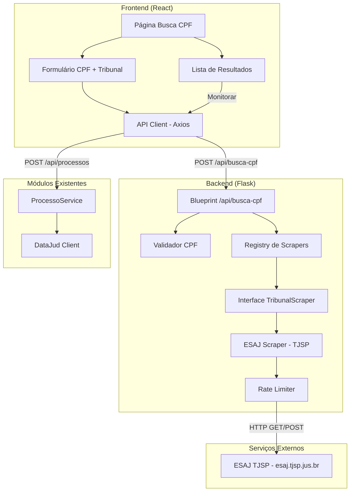
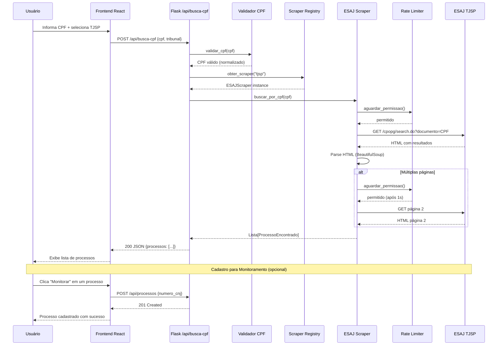

# Documento de Design — Busca de Processos por CPF (TJSP)

## Visão Geral

Este documento descreve o design técnico da funcionalidade de busca de processos judiciais por CPF no TJSP via web scraping do sistema ESAJ. A funcionalidade se integra ao sistema existente de monitoramento de processos judiciais, adicionando uma nova forma de descoberta de processos — por documento da parte — complementando a busca por número CNJ já existente via DataJud API.

### Decisões de Design

| Decisão | Escolha | Justificativa |
|---------|---------|---------------|
| Web Scraping | requests + BeautifulSoup | ESAJ é server-rendered HTML, não requer JS |
| Rate Limiting | Token Bucket (time-based) | Simplicidade, controle preciso de intervalo |
| Arquitetura Scraper | Abstract Base Class (ABC) | Extensibilidade para outros tribunais |
| Validação CPF | Módulo dedicado | Reutilizável, testável isoladamente |
| API Endpoint | Flask Blueprint | Consistente com padrão existente |
| Frontend | Novo componente React + página | Consistente com estrutura existente |

### Escopo

- **Implementação inicial**: Apenas TJSP (ESAJ)
- **Extensibilidade**: Interface `TribunalScraper` permite adicionar outros tribunais
- **Integração**: Processos encontrados podem ser cadastrados para monitoramento via DataJud

---

## Arquitetura

### Diagrama de Componentes



### Fluxo de Dados



---

## Componentes e Interfaces

### Interface TribunalScraper (Abstract Base Class)

```python
from abc import ABC, abstractmethod
from dataclasses import dataclass, field
from typing import List, Optional


@dataclass
class ProcessoEncontrado:
    """Processo retornado pela busca por CPF em um tribunal."""
    numero_cnj: str
    classe: str
    assunto: str
    partes: List[str] = field(default_factory=list)
    vara: Optional[str] = None
    data_distribuicao: Optional[str] = None


class TribunalScraper(ABC):
    """Interface abstrata para scrapers de tribunais.
    
    Cada tribunal que suporta busca por CPF deve implementar
    esta interface com sua lógica específica de scraping.
    """

    @property
    @abstractmethod
    def tribunal_id(self) -> str:
        """Identificador único do tribunal (ex: 'tjsp')."""
        ...

    @property
    @abstractmethod
    def tribunal_nome(self) -> str:
        """Nome legível do tribunal (ex: 'TJSP - Tribunal de Justiça de São Paulo')."""
        ...

    @abstractmethod
    def buscar_por_cpf(self, cpf: str) -> List[ProcessoEncontrado]:
        """Busca processos associados a um CPF no tribunal.
        
        Args:
            cpf: CPF normalizado (11 dígitos numéricos, já validado).
            
        Returns:
            Lista de ProcessoEncontrado com dados extraídos.
            
        Raises:
            TribunalIndisponivelError: Tribunal offline ou timeout.
            CaptchaDetectadoError: Tribunal exigindo CAPTCHA.
            ScrapingError: Erro ao interpretar resposta do tribunal.
        """
        ...
```

### Scraper Registry

```python
class ScraperRegistry:
    """Registro de scrapers disponíveis por tribunal.
    
    Permite adicionar novos scrapers sem modificar código existente.
    """

    def __init__(self):
        self._scrapers: dict[str, TribunalScraper] = {}

    def registrar(self, scraper: TribunalScraper) -> None:
        """Registra um scraper no registry."""
        self._scrapers[scraper.tribunal_id] = scraper

    def obter(self, tribunal_id: str) -> TribunalScraper:
        """Obtém scraper pelo ID do tribunal.
        
        Raises:
            TribunalNaoSuportadoError: Se não há scraper para o tribunal.
        """
        ...

    def listar_disponiveis(self) -> List[dict]:
        """Lista tribunais com scraper disponível.
        
        Returns:
            Lista de {id, nome} dos tribunais suportados.
        """
        ...
```

### ESAJ Scraper (TJSP)

```python
class ESAJScraperTJSP(TribunalScraper):
    """Scraper para o sistema ESAJ do TJSP.
    
    URL base: https://esaj.tjsp.jus.br/cpopg/search.do
    Método de busca: POST com parâmetro de documento da parte.
    """

    BASE_URL = "https://esaj.tjsp.jus.br/cpopg/search.do"
    TIMEOUT = 30  # segundos

    def __init__(self, rate_limiter: RateLimiter):
        self._rate_limiter = rate_limiter
        self._session = requests.Session()
        self._session.headers.update({
            'User-Agent': 'Mozilla/5.0 (compatible; MonitorJudicial/1.0)',
        })

    @property
    def tribunal_id(self) -> str:
        return "tjsp"

    @property
    def tribunal_nome(self) -> str:
        return "TJSP - Tribunal de Justiça de São Paulo"

    def buscar_por_cpf(self, cpf: str) -> List[ProcessoEncontrado]:
        """Busca processos por CPF no ESAJ/TJSP.
        
        Fluxo:
        1. Envia requisição de busca com CPF como documento da parte
        2. Parseia HTML de resultados com BeautifulSoup
        3. Se há paginação, navega por todas as páginas
        4. Retorna lista consolidada de processos
        """
        ...

    def _fazer_requisicao_busca(self, cpf: str, pagina: int = 1) -> str:
        """Faz requisição ao ESAJ e retorna HTML da resposta."""
        ...

    def _parsear_resultados(self, html: str) -> List[ProcessoEncontrado]:
        """Extrai processos do HTML de resultados."""
        ...

    def _detectar_captcha(self, html: str) -> bool:
        """Verifica se a resposta contém CAPTCHA."""
        ...

    def _obter_total_paginas(self, html: str) -> int:
        """Extrai número total de páginas dos resultados."""
        ...
```

### Validador de CPF

```python
class CPFValidator:
    """Validador de CPF com verificação de formato e dígitos verificadores.
    
    Regras:
    - Aceita com ou sem formatação (XXX.XXX.XXX-XX ou XXXXXXXXXXX)
    - Rejeita CPFs com todos os dígitos iguais
    - Valida dígitos verificadores (algoritmo módulo 11)
    """

    @staticmethod
    def validar(cpf: str) -> bool:
        """Valida formato e dígitos verificadores do CPF.
        
        Args:
            cpf: String com CPF (com ou sem formatação).
            
        Returns:
            True se CPF é válido, False caso contrário.
        """
        ...

    @staticmethod
    def normalizar(cpf: str) -> str:
        """Remove formatação do CPF, retornando apenas 11 dígitos.
        
        Args:
            cpf: String com CPF (com ou sem formatação).
            
        Returns:
            String com 11 dígitos numéricos.
            
        Raises:
            ValueError: Se não é possível extrair 11 dígitos.
        """
        ...

    @staticmethod
    def formatar(cpf: str) -> str:
        """Aplica formatação XXX.XXX.XXX-XX ao CPF.
        
        Args:
            cpf: String com 11 dígitos numéricos.
            
        Returns:
            String formatada como XXX.XXX.XXX-XX.
        """
        ...
```

### Rate Limiter

```python
import time
import threading


class RateLimiter:
    """Rate limiter baseado em intervalo mínimo entre requisições.
    
    Implementa controle de frequência thread-safe para evitar
    sobrecarga no servidor do tribunal.
    
    Configuração padrão:
    - Busca inicial: 1 requisição a cada 2 segundos
    - Paginação: 1 requisição a cada 1 segundo
    """

    def __init__(self, intervalo_minimo: float = 2.0):
        """
        Args:
            intervalo_minimo: Segundos mínimos entre requisições.
        """
        self._intervalo = intervalo_minimo
        self._ultimo_request: float = 0.0
        self._lock = threading.Lock()

    def aguardar(self) -> None:
        """Bloqueia até que o intervalo mínimo seja respeitado.
        
        Thread-safe: múltiplas threads podem chamar simultaneamente.
        """
        ...

    def aguardar_paginacao(self) -> None:
        """Aguarda intervalo reduzido para requisições de paginação (1s)."""
        ...

    @property
    def tempo_espera(self) -> float:
        """Retorna tempo de espera estimado (em segundos) até próxima permissão."""
        ...
```

### Blueprint /api/busca-cpf

```python
busca_cpf_bp = Blueprint('busca_cpf', __name__, url_prefix='/api')


@busca_cpf_bp.route('/busca-cpf', methods=['POST'])
def buscar_por_cpf():
    """Busca processos por CPF em um tribunal.
    
    Body JSON:
        cpf (str): CPF com ou sem formatação
        tribunal (str): ID do tribunal (ex: "tjsp")
    
    Returns:
        200: {processos: [...], total: N, tribunal: "tjsp"}
        400: CPF inválido ou tribunal não informado
        502: Tribunal indisponível
        503: CAPTCHA detectado
    """
    ...


@busca_cpf_bp.route('/busca-cpf/tribunais', methods=['GET'])
def listar_tribunais_busca_cpf():
    """Lista tribunais disponíveis para busca por CPF.
    
    Returns:
        200: {tribunais: [{id, nome}]}
    """
    ...
```

### Exceções Customizadas

```python
class TribunalIndisponivelError(Exception):
    """Tribunal offline, timeout ou erro de conexão."""
    def __init__(self, tribunal: str, motivo: str):
        self.tribunal = tribunal
        self.motivo = motivo
        super().__init__(f"Tribunal {tribunal} indisponível: {motivo}")


class CaptchaDetectadoError(Exception):
    """Tribunal exigindo verificação CAPTCHA."""
    def __init__(self, tribunal: str):
        self.tribunal = tribunal
        super().__init__(f"CAPTCHA detectado no tribunal {tribunal}")


class ScrapingError(Exception):
    """Erro ao interpretar resposta HTML do tribunal."""
    def __init__(self, tribunal: str, detalhes: str):
        self.tribunal = tribunal
        self.detalhes = detalhes
        super().__init__(f"Erro de scraping no {tribunal}: {detalhes}")


class TribunalNaoSuportadoError(Exception):
    """Tribunal não possui scraper registrado."""
    def __init__(self, tribunal_id: str):
        self.tribunal_id = tribunal_id
        super().__init__(f"Tribunal não suportado para busca por CPF: {tribunal_id}")


class CPFInvalidoError(Exception):
    """CPF com formato ou dígitos verificadores inválidos."""
    def __init__(self, motivo: str):
        self.motivo = motivo
        super().__init__(f"CPF inválido: {motivo}")
```

### Frontend — Componente BuscaCPF

```
frontend/src/
├── components/
│   └── BuscaCPF/
│       └── index.jsx          # Formulário + lista de resultados
├── pages/
│   └── BuscaCPFPage.jsx       # Página wrapper
└── services/
    └── api.js                 # + buscarPorCPF(), getTribunaisBuscaCPF()
```

**Componente principal** (`BuscaCPF/index.jsx`):
- Campo de CPF com máscara (XXX.XXX.XXX-XX)
- Dropdown de tribunal (inicialmente só TJSP)
- Botão "Buscar"
- Indicador de carregamento (spinner)
- Lista de resultados com botão "Monitorar" por processo
- Mensagens de erro/vazio

**Novas funções em `api.js`**:
```javascript
export function buscarPorCPF(cpf, tribunal) {
  return api.post('/busca-cpf', { cpf, tribunal });
}

export function getTribunaisBuscaCPF() {
  return api.get('/busca-cpf/tribunais');
}
```

---

## Modelos de Dados

### DTOs (Data Transfer Objects)

Os dados desta funcionalidade são transientes — não são persistidos em banco. A busca por CPF retorna resultados que o usuário pode opcionalmente cadastrar para monitoramento (usando o fluxo existente via DataJud).

```python
@dataclass
class ProcessoEncontrado:
    """Processo retornado pela busca por CPF no tribunal."""
    numero_cnj: str           # Ex: "1234567-89.2023.8.26.0100"
    classe: str               # Ex: "Procedimento Comum Cível"
    assunto: str              # Ex: "Indenização por Dano Moral"
    partes: List[str]         # Ex: ["João Silva", "Maria Santos"]
    vara: Optional[str]       # Ex: "1ª Vara Cível"
    data_distribuicao: Optional[str]  # Ex: "15/03/2023"
```

### Resposta da API

```json
{
  "processos": [
    {
      "numero_cnj": "1234567-89.2023.8.26.0100",
      "classe": "Procedimento Comum Cível",
      "assunto": "Indenização por Dano Moral",
      "partes": ["João Silva", "Maria Santos"],
      "vara": "1ª Vara Cível",
      "data_distribuicao": "15/03/2023"
    }
  ],
  "total": 3,
  "tribunal": "tjsp",
  "tribunal_nome": "TJSP - Tribunal de Justiça de São Paulo"
}
```

### Parâmetros de Busca no ESAJ

O ESAJ do TJSP aceita busca por documento da parte via formulário POST:

```
URL: https://esaj.tjsp.jus.br/cpopg/search.do
Método: GET (com query params) ou POST

Parâmetros relevantes:
- conversationId: (vazio)
- dadosConsulta.localPesquisa.cdLocal: -1 (todos os foros)
- cbPesquisa: DOCPARTE (busca por documento da parte)
- dadosConsulta.tipoNuProcesso: UNIFICADO
- numeroDigitoAnoUnificado: (vazio)
- foroNumeroUnificado: (vazio)
- dadosConsulta.valorConsultaNuUnificado: (vazio)
- dadosConsulta.valorConsulta: {CPF_SEM_FORMATACAO}
```

### Estrutura HTML Esperada do ESAJ (Resultados)

O ESAJ retorna resultados em uma tabela HTML com a seguinte estrutura:

```html
<div id="listagemDeProcessos">
  <div class="fundoClaro" id="702...">
    <a class="linkProcesso">1234567-89.2023.8.26.0100</a>
    <span class="labelClass">Classe:</span> Procedimento Comum Cível
    <span class="labelClass">Assunto:</span> Indenização por Dano Moral
    <span class="labelClass">Foro:</span> Foro Central Cível
    <span class="labelClass">Vara:</span> 1ª Vara Cível
    <!-- Partes -->
  </div>
  <!-- Mais processos... -->
</div>

<!-- Paginação -->
<div id="paginacaoSuperior">
  <a class="paginacao">1</a>
  <a class="paginacao">2</a>
</div>
```

---


## Propriedades de Corretude

*Uma propriedade é uma característica ou comportamento que deve ser verdadeiro em todas as execuções válidas de um sistema — essencialmente, uma declaração formal sobre o que o sistema deve fazer. Propriedades servem como ponte entre especificações legíveis por humanos e garantias de corretude verificáveis por máquina.*

### Propriedade 1: Rejeição de CPF com formato inválido

*Para qualquer* string que não contenha exatamente 11 dígitos numéricos (após remoção de pontos e traço), o validador de CPF SHALL retornar falso e a busca SHALL ser rejeitada sem enviar requisição ao ESAJ.

**Valida: Requisitos 2.1**

### Propriedade 2: Rejeição de CPF com dígitos verificadores incorretos

*Para qualquer* sequência de 9 dígitos seguida de 2 dígitos que NÃO correspondam ao cálculo módulo 11, o validador de CPF SHALL retornar falso. Isso inclui CPFs com todos os dígitos iguais (000...0 até 999...9).

**Valida: Requisitos 2.2, 2.3**

### Propriedade 3: Round-trip de formatação/normalização de CPF

*Para qualquer* CPF válido (11 dígitos com check digits corretos), aplicar formatação (XXX.XXX.XXX-XX) e depois normalização (remoção de pontos e traço) SHALL produzir os mesmos 11 dígitos originais.

**Valida: Requisitos 2.4**

### Propriedade 4: Extração completa de dados do HTML do ESAJ

*Para qualquer* HTML válido no formato do ESAJ contendo N processos (N ≥ 1), o parser SHALL extrair exatamente N objetos ProcessoEncontrado, cada um contendo: numero_cnj não-vazio, classe não-vazia, assunto não-vazio e lista de partes.

**Valida: Requisitos 3.2, 3.4**

### Propriedade 5: HTML inesperado gera erro de scraping

*Para qualquer* string HTML que não contenha a estrutura esperada do ESAJ (ausência do container de resultados ou dos elementos de processo), o parser SHALL lançar ScrapingError com detalhes sobre quais elementos estão ausentes.

**Valida: Requisitos 4.3**

### Propriedade 6: Rate limiter garante intervalo mínimo entre requisições

*Para qualquer* sequência de N requisições (N ≥ 2) submetidas ao rate limiter, o intervalo de tempo entre a i-ésima e a (i+1)-ésima requisição efetivamente executada SHALL ser ≥ 2 segundos.

**Valida: Requisitos 5.1, 5.2**

### Propriedade 7: Rate limiter garante intervalo de paginação

*Para qualquer* sequência de requisições de paginação consecutivas, o intervalo entre cada par de requisições SHALL ser ≥ 1 segundo.

**Valida: Requisitos 5.4**

### Propriedade 8: Resultados da busca contêm informações obrigatórias

*Para qualquer* resposta da API /busca-cpf com processos encontrados, cada processo na lista SHALL conter os campos: numero_cnj (formato CNJ válido), classe (não-vazio), assunto (não-vazio) e partes (lista não-vazia).

**Valida: Requisitos 1.4**

---

## Tratamento de Erros

### Erros do ESAJ/TJSP

| Cenário | Exceção | Resposta HTTP | Mensagem ao Usuário |
|---------|---------|---------------|---------------------|
| Timeout (>30s) | `TribunalIndisponivelError` | 502 | "O TJSP está temporariamente indisponível. Tente novamente em alguns minutos." |
| Erro de conexão | `TribunalIndisponivelError` | 502 | "Não foi possível conectar ao TJSP. Tente novamente em alguns minutos." |
| CAPTCHA detectado | `CaptchaDetectadoError` | 503 | "O TJSP está exigindo verificação humana. Acesse diretamente: [link ESAJ]" |
| HTML inesperado | `ScrapingError` | 502 | "Ocorreu um erro ao ler os dados do TJSP. A equipe técnica foi notificada." |
| HTTP 403 | `TribunalIndisponivelError` | 502 | "Acesso temporariamente bloqueado pelo TJSP. Tente novamente mais tarde." |
| HTTP 5xx | `TribunalIndisponivelError` | 502 | "O TJSP está com problemas técnicos. Tente novamente mais tarde." |

### Erros de Validação

| Cenário | Exceção | Resposta HTTP | Mensagem ao Usuário |
|---------|---------|---------------|---------------------|
| CPF formato inválido | `CPFInvalidoError` | 400 | "CPF inválido. Informe 11 dígitos numéricos (com ou sem formatação)." |
| CPF dígitos incorretos | `CPFInvalidoError` | 400 | "CPF inválido. Verifique os dígitos informados." |
| Tribunal não informado | — | 400 | "Selecione um tribunal para realizar a busca." |
| Tribunal não suportado | `TribunalNaoSuportadoError` | 400 | "Tribunal selecionado não suporta busca por CPF." |

### Erros de Cadastro para Monitoramento

| Cenário | Comportamento |
|---------|---------------|
| Processo não encontrado na DataJud | Exibe mensagem de erro, mantém processo na lista |
| Processo já cadastrado | Exibe "Já monitorado" (sem erro) |
| DataJud indisponível | Exibe mensagem de erro temporário |

### Logging

Todos os erros de scraping são logados com nível ERROR incluindo:
- Tribunal e CPF (mascarado: `***.***.XXX-XX`)
- Tipo de erro
- Detalhes técnicos (HTML truncado para erros de parsing)
- Timestamp

CPFs completos NUNCA são logados por questões de privacidade.

---

## Estratégia de Testes

### Abordagem Dual

O sistema utiliza duas abordagens complementares:

1. **Testes Unitários (example-based)**: Cenários específicos, edge cases, integração com ESAJ (mockado)
2. **Testes de Propriedade (property-based)**: Propriedades universais com inputs gerados aleatoriamente

### Biblioteca de Property-Based Testing

- **Biblioteca**: [Hypothesis](https://hypothesis.readthedocs.io/) (Python)
- **Configuração**: Mínimo de 100 iterações por teste de propriedade
- **Tag format**: `Feature: busca-cpf-tjsp, Property {N}: {texto}`

### Cobertura de Testes

| Módulo | Tipo de Teste | Propriedades |
|--------|---------------|--------------|
| `cpf_validator.py` | Property + Unit | Props 1, 2, 3 |
| `esaj_scraper.py` (parser) | Property + Unit | Props 4, 5 |
| `rate_limiter.py` | Property + Unit | Props 6, 7 |
| `routes/busca_cpf.py` | Unit + Integration | Prop 8 |
| `scraper_registry.py` | Unit | — |
| Frontend `BuscaCPF` | Unit (Jest/RTL) | — |

### Testes de Propriedade — Implementação

Cada propriedade será implementada como um único teste usando Hypothesis:

```python
from hypothesis import given, settings
from hypothesis import strategies as st

# Property 1: Rejeição de CPF com formato inválido
@settings(max_examples=100)
@given(texto=st.text(min_size=0, max_size=20).filter(
    lambda s: len(re.sub(r'\D', '', s)) != 11
))
def test_prop1_rejeicao_cpf_formato_invalido(texto):
    """Feature: busca-cpf-tjsp, Property 1: Rejeição de CPF com formato inválido"""
    assert CPFValidator.validar(texto) is False


# Property 2: Rejeição de CPF com dígitos verificadores incorretos
@settings(max_examples=100)
@given(prefixo=st.text(alphabet='0123456789', min_size=9, max_size=9))
def test_prop2_rejeicao_cpf_digitos_incorretos(prefixo):
    """Feature: busca-cpf-tjsp, Property 2: Rejeição de CPF com dígitos verificadores incorretos"""
    # Calcula dígitos corretos e usa dígitos diferentes
    ...


# Property 3: Round-trip formatação/normalização
@settings(max_examples=100)
@given(cpf=st.from_regex(r'[0-9]{11}', fullmatch=True).filter(cpf_valido))
def test_prop3_roundtrip_formatacao(cpf):
    """Feature: busca-cpf-tjsp, Property 3: Round-trip de formatação/normalização"""
    formatado = CPFValidator.formatar(cpf)
    normalizado = CPFValidator.normalizar(formatado)
    assert normalizado == cpf


# Property 4: Extração completa de dados do HTML
@settings(max_examples=100)
@given(dados=st.lists(st.builds(ProcessoEncontrado, ...), min_size=1, max_size=10))
def test_prop4_extracao_html(dados):
    """Feature: busca-cpf-tjsp, Property 4: Extração completa de dados do HTML do ESAJ"""
    html = gerar_html_esaj(dados)  # Helper que gera HTML no formato ESAJ
    resultado = parser.parsear_resultados(html)
    assert len(resultado) == len(dados)
    for proc in resultado:
        assert proc.numero_cnj != ""
        assert proc.classe != ""
        assert proc.assunto != ""


# Property 6: Rate limiter intervalo mínimo
@settings(max_examples=100)
@given(n_requests=st.integers(min_value=2, max_value=5))
def test_prop6_rate_limiter_intervalo(n_requests):
    """Feature: busca-cpf-tjsp, Property 6: Rate limiter garante intervalo mínimo"""
    limiter = RateLimiter(intervalo_minimo=2.0)
    timestamps = []
    for _ in range(n_requests):
        limiter.aguardar()
        timestamps.append(time.time())
    for i in range(1, len(timestamps)):
        assert timestamps[i] - timestamps[i-1] >= 2.0
```

### Testes Unitários — Cenários Chave

- Validação CPF: todos os 10 CPFs com dígitos repetidos (edge case 2.3)
- ESAJ timeout e erro de conexão (Req 4.1)
- Detecção de CAPTCHA no HTML (Req 4.2)
- Busca sem resultados (Req 1.5)
- Paginação com 1, 2 e 3 páginas (Req 3.3)
- Cadastro de processo encontrado para monitoramento (Req 6.2)
- Processo já monitorado (Req 6.3)
- Tribunal não suportado (Req 7.3)

### Testes de Integração

- Fluxo completo: CPF válido → busca ESAJ (mockado) → resultados
- Fluxo: resultado → clique "Monitorar" → cadastro via DataJud
- Rate limiter com múltiplas requisições concorrentes

### Estrutura de Testes

```
backend/tests/
├── unit/
│   ├── test_cpf_validator.py
│   ├── test_esaj_scraper.py
│   ├── test_rate_limiter.py
│   ├── test_scraper_registry.py
│   └── test_busca_cpf_routes.py
├── property/
│   ├── test_prop_cpf_validation.py      # Props 1, 2, 3
│   ├── test_prop_esaj_parser.py         # Props 4, 5
│   └── test_prop_rate_limiter.py        # Props 6, 7
└── integration/
    └── test_busca_cpf_integration.py    # Prop 8
```
