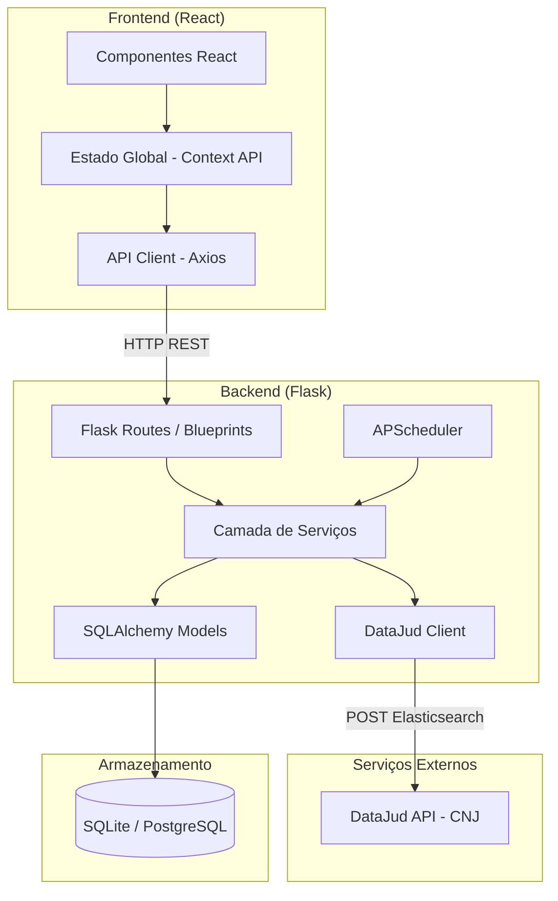
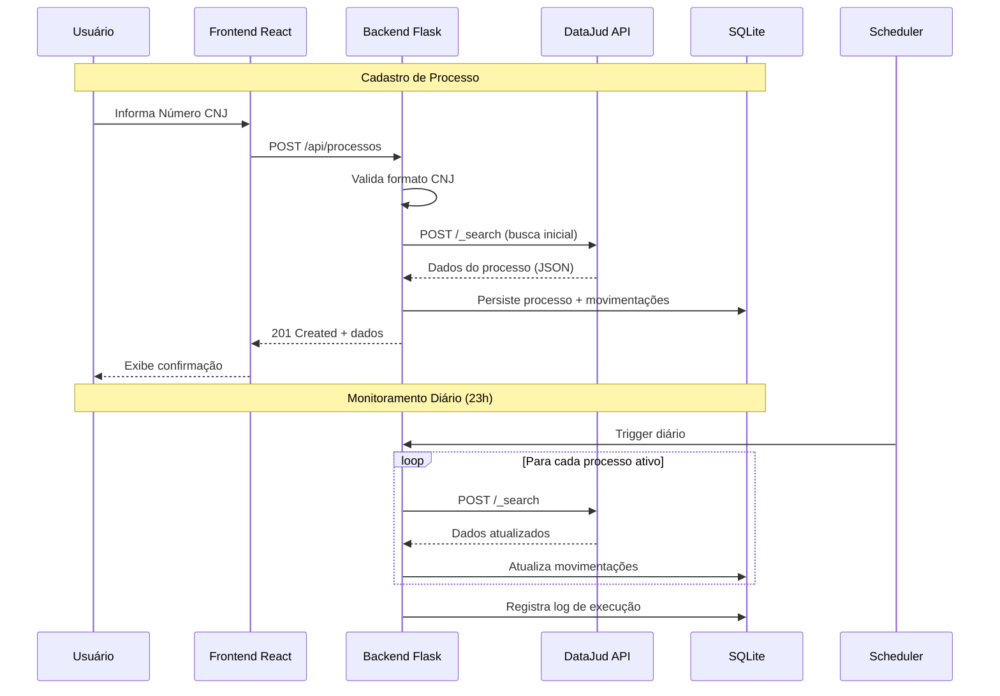
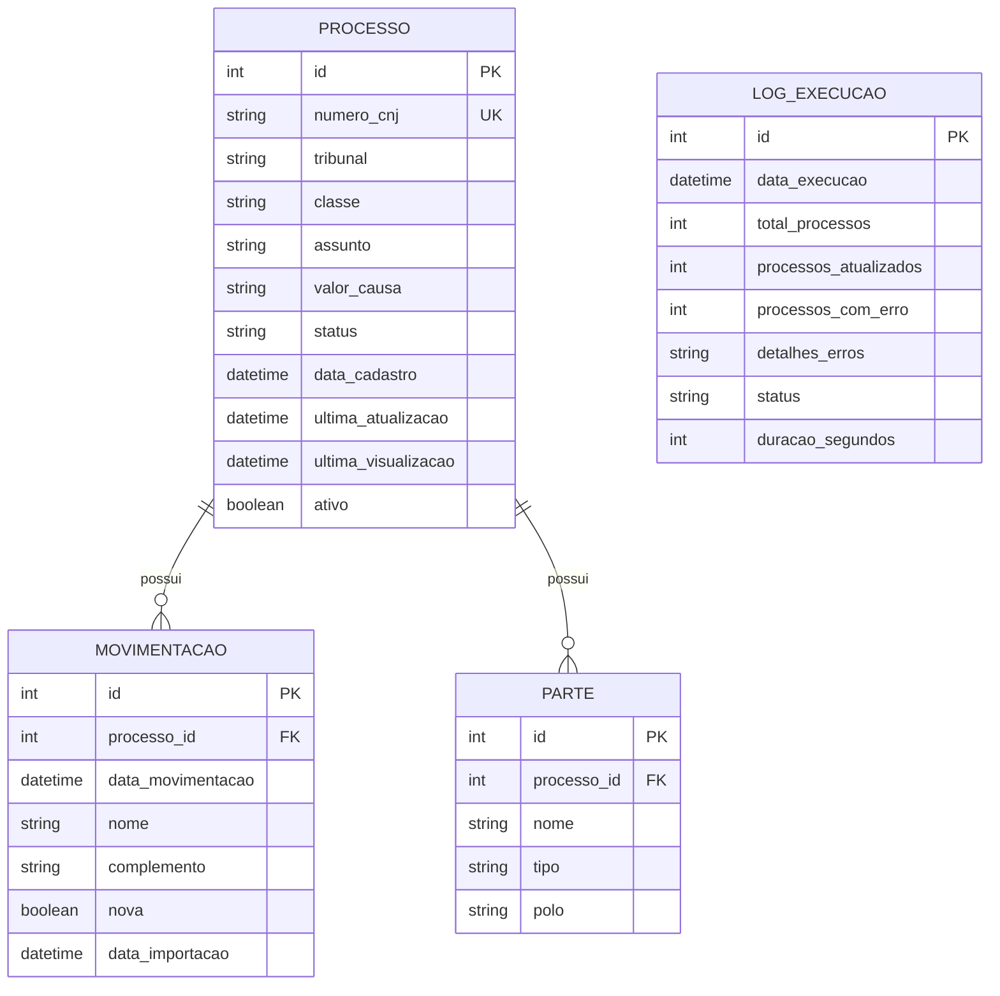

# Documento de Design — Monitoramento de Processos Judiciais

## Visão Geral

Este documento descreve a arquitetura e o design técnico do sistema de monitoramento de processos judiciais. O sistema é composto por um backend Flask (Python) que expõe uma API REST, um frontend React para visualização e gerenciamento, e um banco de dados SQLite com SQLAlchemy ORM (preparado para migração futura para PostgreSQL).

A integração principal é com a API pública DataJud do CNJ, que utiliza Elasticsearch como motor de busca e cobre todos os tribunais brasileiros. O sistema realiza monitoramento diário automatizado (23h) e oferece consultas avulsas sob demanda.

### Decisões de Design

| Decisão | Escolha | Justificativa |
|---------|---------|---------------|
| Backend | Python Flask | Simplicidade, ecossistema rico para integração com APIs |
| Frontend | React | Componentização, reatividade, ecossistema maduro |
| Banco de Dados | SQLite + SQLAlchemy | Simplicidade para MVP, migração fácil para PostgreSQL |
| Scheduler | APScheduler | Integração nativa com Flask, suporte a cron jobs |
| HTTP Client | requests + tenacity | Retry robusto com backoff exponencial |
| DataJud API | Elasticsearch Query DSL | API pública do CNJ, cobertura nacional |

---

## Arquitetura

### Diagrama de Componentes



### Fluxo de Dados



---

## Componentes e Interfaces

### Backend — Estrutura de Diretórios

```
backend/
├── app/
│   ├── __init__.py          # Flask app factory
│   ├── config.py            # Configurações (dev, prod)
│   ├── models/
│   │   ├── __init__.py
│   │   ├── processo.py      # Modelo Processo
│   │   ├── movimentacao.py  # Modelo Movimentação
│   │   ├── parte.py         # Modelo Parte
│   │   └── log_execucao.py  # Modelo Log de Execução
│   ├── routes/
│   │   ├── __init__.py
│   │   ├── processos.py     # CRUD de processos
│   │   ├── consulta.py      # Consulta avulsa
│   │   └── health.py        # Health check
│   ├── services/
│   │   ├── __init__.py
│   │   ├── processo_service.py    # Lógica de negócio
│   │   ├── datajud_client.py      # Cliente DataJud API
│   │   ├── cnj_validator.py       # Validação de número CNJ
│   │   └── scheduler_service.py   # Agendamento
│   └── utils/
│       ├── __init__.py
│       └── tribunal_mapper.py     # Mapeamento tribunal → endpoint
├── migrations/              # Alembic migrations
├── tests/
│   ├── unit/
│   ├── integration/
│   └── property/
├── requirements.txt
└── run.py
```

### Frontend — Estrutura de Diretórios

```
frontend/
├── src/
│   ├── components/
│   │   ├── ProcessoList/        # Lista de processos monitorados
│   │   ├── ProcessoDetail/      # Visualização detalhada
│   │   ├── ProcessoForm/        # Formulário de cadastro
│   │   ├── ConsultaAvulsa/      # Consulta sem salvar
│   │   ├── MovimentacaoList/    # Lista de movimentações
│   │   └── common/             # Componentes reutilizáveis
│   ├── pages/
│   │   ├── Dashboard.jsx        # Página principal
│   │   ├── ProcessoPage.jsx     # Detalhe do processo
│   │   └── ConsultaPage.jsx     # Consulta avulsa
│   ├── services/
│   │   └── api.js              # Cliente HTTP (Axios)
│   ├── context/
│   │   └── ProcessoContext.jsx  # Estado global
│   ├── utils/
│   │   └── cnjFormatter.js     # Formatação/validação CNJ
│   ├── App.jsx
│   └── main.jsx
├── package.json
└── vite.config.js
```

### API REST — Endpoints

| Método | Endpoint | Descrição | Req. |
|--------|----------|-----------|------|
| `GET` | `/api/processos` | Lista processos cadastrados | 1, 4 |
| `POST` | `/api/processos` | Cadastra novo processo | 1 |
| `GET` | `/api/processos/<id>` | Detalhes de um processo | 4 |
| `DELETE` | `/api/processos/<id>` | Remove processo do monitoramento | 1 |
| `GET` | `/api/processos/<id>/movimentacoes` | Movimentações de um processo | 4 |
| `POST` | `/api/consulta-avulsa` | Consulta avulsa (sem persistir) | 5 |
| `GET` | `/api/health` | Health check + status DataJud | 6 |
| `GET` | `/api/monitoramento/status` | Status do último monitoramento | 2 |
| `GET` | `/api/tribunais` | Lista tribunais suportados | 3 |

### Interface do DataJud Client

```python
class DataJudClient:
    """Cliente para a API pública DataJud do CNJ."""

    BASE_URL = "https://api-publica.datajud.cnj.jus.br"
    API_KEY = "cDZHYzlZa0JadVREZDJCendQbXY6SkJlTzNjLV9TRENyQk1RdnFKZGRQdw=="

    def buscar_processo(self, numero_cnj: str) -> Optional[ProcessoDTO]:
        """
        Busca um processo pelo número CNJ na DataJud API.
        
        Args:
            numero_cnj: Número do processo no formato NNNNNNN-DD.AAAA.J.TR.OOOO
            
        Returns:
            ProcessoDTO com dados do processo ou None se não encontrado.
            
        Raises:
            DataJudAPIError: Em caso de erro de comunicação.
            DataJudTimeoutError: Em caso de timeout.
        """
        ...

    def health_check(self) -> HealthStatus:
        """Verifica conectividade com a DataJud API."""
        ...
```

### Interface do Serviço de Processos

```python
class ProcessoService:
    """Serviço de lógica de negócio para processos judiciais."""

    def cadastrar_processo(self, numero_cnj: str) -> Processo:
        """Cadastra processo e realiza busca inicial na DataJud."""
        ...

    def atualizar_processo(self, processo_id: int) -> AtualizacaoResult:
        """Atualiza dados de um processo via DataJud."""
        ...

    def consulta_avulsa(self, numero_cnj: str) -> ProcessoDTO:
        """Realiza consulta sem persistir dados."""
        ...

    def executar_monitoramento_diario(self) -> MonitoramentoLog:
        """Executa verificação de todos os processos ativos."""
        ...
```

---

## Modelos de Dados

### Diagrama ER



### SQLAlchemy Models

```python
from datetime import datetime
from app import db


class Processo(db.Model):
    """Processo judicial cadastrado para monitoramento."""
    __tablename__ = 'processos'

    id = db.Column(db.Integer, primary_key=True)
    numero_cnj = db.Column(db.String(25), unique=True, nullable=False, index=True)
    tribunal = db.Column(db.String(10))
    classe = db.Column(db.String(200))
    assunto = db.Column(db.String(500))
    valor_causa = db.Column(db.String(50))
    status = db.Column(db.String(50), default='ativo')
    data_cadastro = db.Column(db.DateTime, default=datetime.utcnow)
    ultima_atualizacao = db.Column(db.DateTime)
    ultima_visualizacao = db.Column(db.DateTime)
    ativo = db.Column(db.Boolean, default=True)

    movimentacoes = db.relationship('Movimentacao', backref='processo', lazy='dynamic',
                                     order_by='Movimentacao.data_movimentacao.desc()')
    partes = db.relationship('Parte', backref='processo', lazy='select')


class Movimentacao(db.Model):
    """Movimentação/andamento de um processo judicial."""
    __tablename__ = 'movimentacoes'

    id = db.Column(db.Integer, primary_key=True)
    processo_id = db.Column(db.Integer, db.ForeignKey('processos.id'), nullable=False)
    data_movimentacao = db.Column(db.DateTime, nullable=False)
    nome = db.Column(db.String(500), nullable=False)
    complemento = db.Column(db.Text)
    nova = db.Column(db.Boolean, default=True)
    data_importacao = db.Column(db.DateTime, default=datetime.utcnow)


class Parte(db.Model):
    """Parte envolvida em um processo judicial."""
    __tablename__ = 'partes'

    id = db.Column(db.Integer, primary_key=True)
    processo_id = db.Column(db.Integer, db.ForeignKey('processos.id'), nullable=False)
    nome = db.Column(db.String(300), nullable=False)
    tipo = db.Column(db.String(100))  # ex: "Advogado", "Autor", "Réu"
    polo = db.Column(db.String(20))   # "ativo", "passivo", "terceiro"


class LogExecucao(db.Model):
    """Log de execução do monitoramento diário."""
    __tablename__ = 'logs_execucao'

    id = db.Column(db.Integer, primary_key=True)
    data_execucao = db.Column(db.DateTime, default=datetime.utcnow)
    total_processos = db.Column(db.Integer, default=0)
    processos_atualizados = db.Column(db.Integer, default=0)
    processos_com_erro = db.Column(db.Integer, default=0)
    detalhes_erros = db.Column(db.Text)
    status = db.Column(db.String(20))  # "sucesso", "parcial", "falha"
    duracao_segundos = db.Column(db.Integer)
```

### Integração com DataJud API

A API DataJud utiliza Elasticsearch como motor de busca. A comunicação é feita via POST com query DSL.

**Endpoint Pattern:**
```
POST https://api-publica.datajud.cnj.jus.br/api_publica_{sigla_tribunal}/_search
```

**Headers:**
```
Authorization: ApiKey cDZHYzlZa0JadVREZDJCendQbXY6SkJlTzNjLV9TRENyQk1RdnFKZGRQdw==
Content-Type: application/json
```

**Request Body (exemplo):**
```json
{
  "query": {
    "match": {
      "numeroProcesso": "0001234-56.2023.8.26.0100"
    }
  }
}
```

**Response (estrutura simplificada):**
```json
{
  "hits": {
    "total": { "value": 1 },
    "hits": [
      {
        "_source": {
          "numeroProcesso": "0001234-56.2023.8.26.0100",
          "classe": { "codigo": 7, "nome": "Procedimento Comum Cível" },
          "assuntos": [{ "codigo": 899, "nome": "Direito Civil" }],
          "tribunal": "TJSP",
          "dataAjuizamento": "2023-03-15",
          "movimentos": [
            {
              "codigo": 12345,
              "nome": "Juntada de Petição",
              "dataHora": "2024-01-10T14:30:00",
              "complementosTabelados": [
                { "nome": "tipo_documento", "valor": "Petição Inicial" }
              ]
            }
          ],
          "partes": [
            {
              "nome": "João da Silva",
              "tipo": "AUTOR",
              "advogados": [{ "nome": "Maria Advogada", "inscricao": "OAB/SP 123456" }]
            }
          ]
        }
      }
    ]
  }
}
```

### Mapeamento Tribunal → Endpoint

O número CNJ contém o código do tribunal nos dígitos de posição específica. O sistema mantém um mapeamento:

```python
TRIBUNAL_ENDPOINTS = {
    "8.26": "tjsp",      # Tribunal de Justiça de São Paulo
    "8.19": "tjrj",      # Tribunal de Justiça do Rio de Janeiro
    "8.13": "tjmg",      # Tribunal de Justiça de Minas Gerais
    "5.01": "trt1",      # TRT 1ª Região
    "5.02": "trt2",      # TRT 2ª Região
    # ... demais tribunais
}
```

A sigla do tribunal é extraída do Número CNJ (formato: `NNNNNNN-DD.AAAA.J.TR.OOOO`) onde `J` é o ramo da justiça e `TR` é o código do tribunal.

### Validação do Número CNJ

```python
import re

CNJ_PATTERN = re.compile(
    r'^(\d{7})-(\d{2})\.(\d{4})\.(\d)\.(\d{2})\.(\d{4})$'
)

def validar_numero_cnj(numero: str) -> bool:
    """
    Valida formato do número CNJ: NNNNNNN-DD.AAAA.J.TR.OOOO
    
    Componentes:
    - NNNNNNN: número sequencial (7 dígitos)
    - DD: dígito verificador (2 dígitos)
    - AAAA: ano de ajuizamento (4 dígitos)
    - J: ramo da justiça (1 dígito)
    - TR: tribunal (2 dígitos)
    - OOOO: origem/vara (4 dígitos)
    """
    return bool(CNJ_PATTERN.match(numero))


def extrair_tribunal(numero_cnj: str) -> str:
    """Extrai identificador do tribunal a partir do número CNJ."""
    match = CNJ_PATTERN.match(numero_cnj)
    if not match:
        raise ValueError(f"Número CNJ inválido: {numero_cnj}")
    justica = match.group(4)  # J
    tribunal = match.group(5)  # TR
    return f"{justica}.{tribunal}"
```

### Design do Scheduler

O monitoramento diário utiliza APScheduler integrado ao Flask:

```python
from apscheduler.schedulers.background import BackgroundScheduler
from apscheduler.triggers.cron import CronTrigger
import pytz

def configurar_scheduler(app):
    """Configura o scheduler para monitoramento diário às 23h (Brasília)."""
    scheduler = BackgroundScheduler()
    brasilia_tz = pytz.timezone('America/Sao_Paulo')

    scheduler.add_job(
        func=executar_monitoramento,
        trigger=CronTrigger(hour=23, minute=0, timezone=brasilia_tz),
        id='monitoramento_diario',
        name='Monitoramento diário de processos',
        replace_existing=True
    )

    scheduler.start()
    return scheduler
```

**Lógica de Retry:**

```python
from tenacity import retry, stop_after_attempt, wait_fixed, retry_if_exception_type

@retry(
    stop=stop_after_attempt(3),
    wait=wait_fixed(1800),  # 30 minutos entre tentativas
    retry=retry_if_exception_type(DataJudAPIError)
)
def executar_monitoramento():
    """Executa monitoramento com retry automático."""
    ...
```

---


## Propriedades de Corretude

*Uma propriedade é uma característica ou comportamento que deve ser verdadeiro em todas as execuções válidas de um sistema — essencialmente, uma declaração formal sobre o que o sistema deve fazer. Propriedades servem como ponte entre especificações legíveis por humanos e garantias de corretude verificáveis por máquina.*

### Propriedade 1: Rejeição de números CNJ inválidos

*Para qualquer* string que não corresponda ao padrão `NNNNNNN-DD.AAAA.J.TR.OOOO` (onde cada componente tem o número correto de dígitos e separadores), a função de validação SHALL retornar falso e o cadastro SHALL ser rejeitado sem alteração no banco de dados.

**Valida: Requisitos 1.2**

### Propriedade 2: Completude de dados no cadastro

*Para qualquer* número CNJ válido com dados retornados pela API (mockada), após o cadastro, o processo persistido no banco SHALL conter todos os campos obrigatórios: número_cnj, tribunal, classe, assunto, lista de partes, data de cadastro e status.

**Valida: Requisitos 1.1, 1.5**

### Propriedade 3: Monitoramento consulta todos os processos ativos

*Para qualquer* conjunto de processos cadastrados (com mix de ativos e inativos), a execução do monitoramento diário SHALL consultar a DataJud API exatamente uma vez para cada processo com `ativo=True` e zero vezes para processos com `ativo=False`.

**Valida: Requisitos 2.2**

### Propriedade 4: Deduplicação de movimentações

*Para qualquer* processo com movimentações existentes, quando a API retorna uma resposta contendo movimentações já armazenadas e movimentações novas, o sistema SHALL adicionar apenas as movimentações que ainda não existem no banco, sem criar duplicatas.

**Valida: Requisitos 2.3**

### Propriedade 5: Precisão do log de monitoramento

*Para qualquer* execução de monitoramento com N processos ativos, onde K obtêm atualizações e E apresentam erros, o log registrado SHALL conter `total_processos = N`, `processos_atualizados = K` e `processos_com_erro = E`, com `N = K + E + processos_sem_alteracao`.

**Valida: Requisitos 2.5**

### Propriedade 6: Mapeamento correto de tribunal a partir do número CNJ

*Para qualquer* número CNJ válido, a função de extração de tribunal SHALL produzir o identificador correto do tribunal (dígitos J.TR) e o endpoint da API SHALL corresponder ao padrão `api_publica_{sigla_tribunal}/_search`.

**Valida: Requisitos 3.2**

### Propriedade 7: Completude da resposta de detalhes do processo

*Para qualquer* processo armazenado com movimentações e partes, a resposta do endpoint de detalhes SHALL conter: número_cnj, tribunal, classe, assunto, partes, valor_causa, ultima_atualizacao, e cada movimentação SHALL conter data, nome e complemento.

**Valida: Requisitos 4.1, 4.2**

### Propriedade 8: Classificação correta de movimentações novas

*Para qualquer* processo com uma data de última visualização `V` e movimentações com datas de importação variadas, todas as movimentações com `data_importacao > V` SHALL ser marcadas como `nova=True`, e todas com `data_importacao <= V` SHALL ser marcadas como `nova=False`.

**Valida: Requisitos 4.3**

### Propriedade 9: Não-persistência da consulta avulsa

*Para qualquer* consulta avulsa realizada com um número CNJ válido, após a conclusão da consulta, o banco de dados SHALL não conter nenhum registro novo de processo, movimentação ou parte referente ao número consultado.

**Valida: Requisitos 5.3**

### Propriedade 10: Detecção de respostas malformadas da API

*Para qualquer* resposta da DataJud API que não corresponda à estrutura esperada (campos ausentes, tipos incorretos), o sistema SHALL registrar um erro detalhado no log identificando quais campos estão faltando ou incorretos, sem lançar exceção não tratada.

**Valida: Requisitos 6.4**

### Propriedade 11: Geração correta de URL do tribunal

*Para qualquer* processo com tribunal conhecido, o sistema SHALL gerar uma URL válida apontando para a página de consulta pública do tribunal de origem correspondente.

**Valida: Requisitos 7.3**

---

## Tratamento de Erros

### Erros da DataJud API

| Cenário | Comportamento | Retry |
|---------|---------------|-------|
| Timeout (>30s) | Log + retry | Sim (3x, intervalo 30min no monitoramento) |
| HTTP 401/403 | Log crítico + alerta | Não |
| HTTP 404 (processo não encontrado) | Retorna "não encontrado" ao usuário | Não |
| HTTP 429 (rate limit) | Log + backoff exponencial | Sim |
| HTTP 5xx | Log + retry | Sim (3x) |
| Resposta malformada | Log detalhado + erro ao usuário | Não |
| Conexão recusada | Log + retry | Sim (3x) |

### Erros de Validação

| Cenário | Comportamento |
|---------|---------------|
| Número CNJ formato inválido | HTTP 400 + mensagem com formato correto |
| Processo já cadastrado | HTTP 409 Conflict |
| Processo não encontrado (local) | HTTP 404 |

### Estratégia de Retry (Monitoramento Diário)

```python
# Configuração de retry para o monitoramento diário
RETRY_CONFIG = {
    "max_attempts": 3,
    "wait_seconds": 1800,  # 30 minutos
    "retry_on": [TimeoutError, ConnectionError, HTTPError5xx],
    "no_retry_on": [HTTPError401, HTTPError403, HTTPError404]
}
```

### Estratégia de Retry (Consultas Individuais)

```python
# Retry mais agressivo para consultas do usuário (resposta rápida)
QUERY_RETRY_CONFIG = {
    "max_attempts": 2,
    "wait_seconds": 3,
    "retry_on": [TimeoutError, ConnectionError],
    "timeout_per_request": 30  # segundos
}
```

---

## Estratégia de Testes

### Abordagem Dual

O sistema utiliza duas abordagens complementares de testes:

1. **Testes Unitários (example-based)**: Verificam cenários específicos, edge cases e condições de erro
2. **Testes de Propriedade (property-based)**: Verificam propriedades universais com inputs gerados aleatoriamente

### Biblioteca de Property-Based Testing

- **Biblioteca**: [Hypothesis](https://hypothesis.readthedocs.io/) (Python)
- **Configuração**: Mínimo de 100 iterações por teste de propriedade
- **Tag format**: `Feature: judicial-process-monitoring, Property {N}: {texto}`

### Cobertura de Testes

| Camada | Tipo de Teste | Foco |
|--------|---------------|------|
| `cnj_validator.py` | Property + Unit | Validação de formato CNJ (Props 1, 6) |
| `datajud_client.py` | Unit + Integration | Comunicação com API, parsing de resposta (Prop 10) |
| `processo_service.py` | Property + Unit | Lógica de negócio, deduplicação (Props 2, 3, 4, 5, 8, 9) |
| `tribunal_mapper.py` | Property | Mapeamento tribunal → endpoint (Props 6, 11) |
| `routes/` | Integration | Endpoints REST, respostas HTTP (Prop 7) |
| `scheduler_service.py` | Unit | Configuração do scheduler |

### Testes de Propriedade — Implementação

Cada propriedade de corretude será implementada como um único teste de propriedade usando Hypothesis:

```python
from hypothesis import given, settings
from hypothesis import strategies as st

@settings(max_examples=100)
@given(numero=st.from_regex(r'\d{7}-\d{2}\.\d{4}\.\d\.\d{2}\.\d{4}', fullmatch=True))
def test_prop1_rejeicao_cnj_invalido(numero):
    """Feature: judicial-process-monitoring, Property 1: Rejeição de números CNJ inválidos"""
    # Gera strings que parecem CNJ mas com formato incorreto
    ...

@settings(max_examples=100)
@given(dados=st.builds(ProcessoAPIResponse, ...))
def test_prop2_completude_dados_cadastro(dados):
    """Feature: judicial-process-monitoring, Property 2: Completude de dados no cadastro"""
    ...
```

### Testes Unitários — Cenários Chave

- Cadastro com API indisponível (Req 1.4)
- Retry do monitoramento após falha (Req 2.4)
- Health check endpoint (Req 6.3)
- Consulta avulsa com erro da API (Req 5.5)
- Mensagem sobre download de documentos (Req 7.1)

### Testes de Integração

- Comunicação real com DataJud API (1-2 exemplos com CNJ conhecido)
- Fluxo completo: cadastro → monitoramento → atualização
- Scheduler trigger e execução

### Estrutura de Testes

```
tests/
├── unit/
│   ├── test_cnj_validator.py
│   ├── test_tribunal_mapper.py
│   ├── test_processo_service.py
│   └── test_datajud_client.py
├── property/
│   ├── test_prop_cnj_validation.py      # Props 1, 6
│   ├── test_prop_processo_service.py    # Props 2, 3, 4, 5, 8, 9
│   ├── test_prop_api_response.py        # Props 7, 10
│   └── test_prop_tribunal_mapping.py    # Prop 11
└── integration/
    ├── test_datajud_integration.py
    ├── test_api_endpoints.py
    └── test_scheduler.py
```
